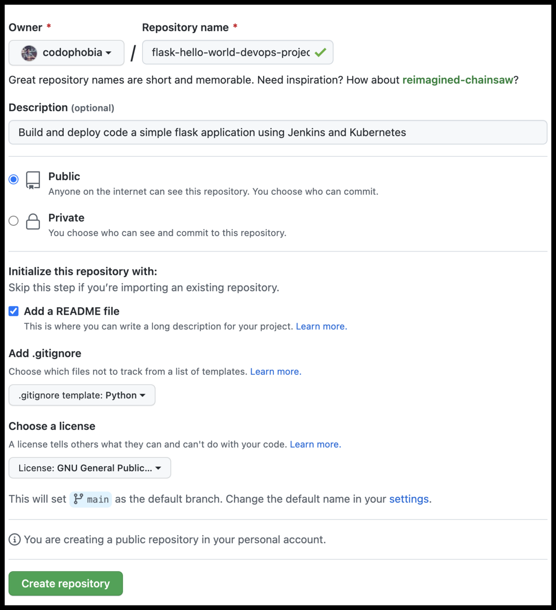
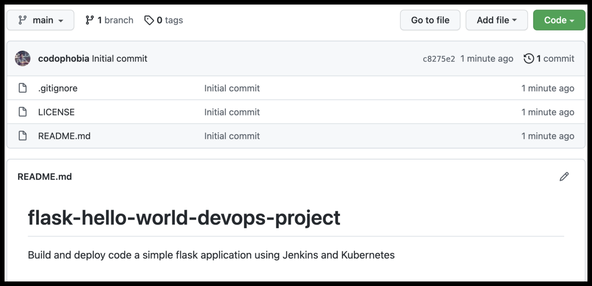
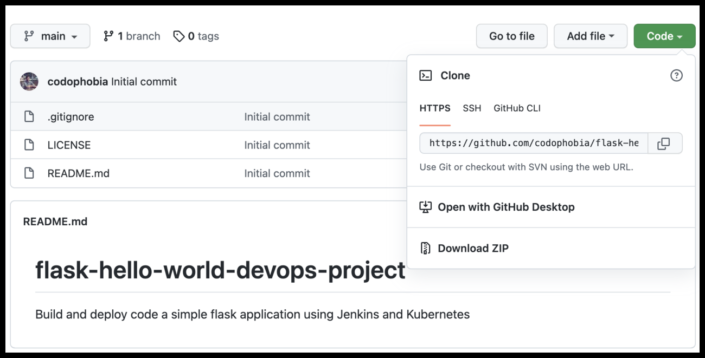
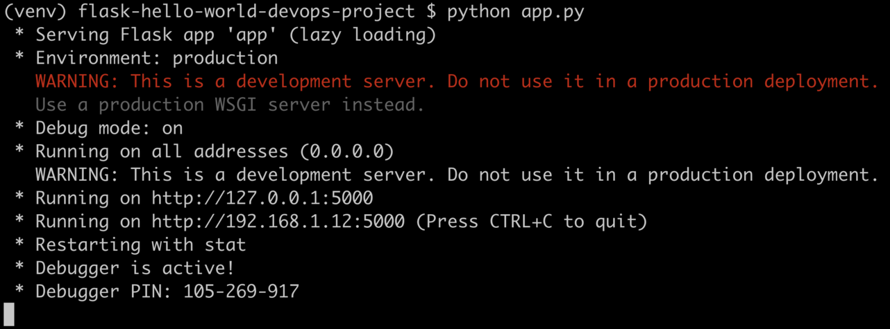
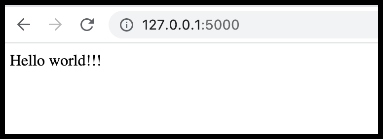
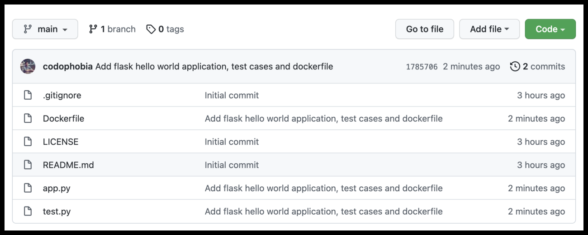
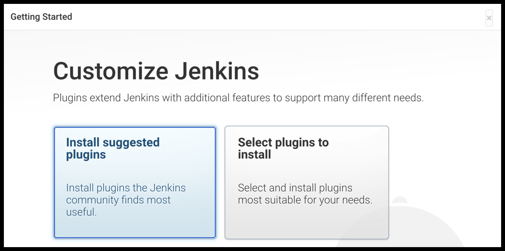
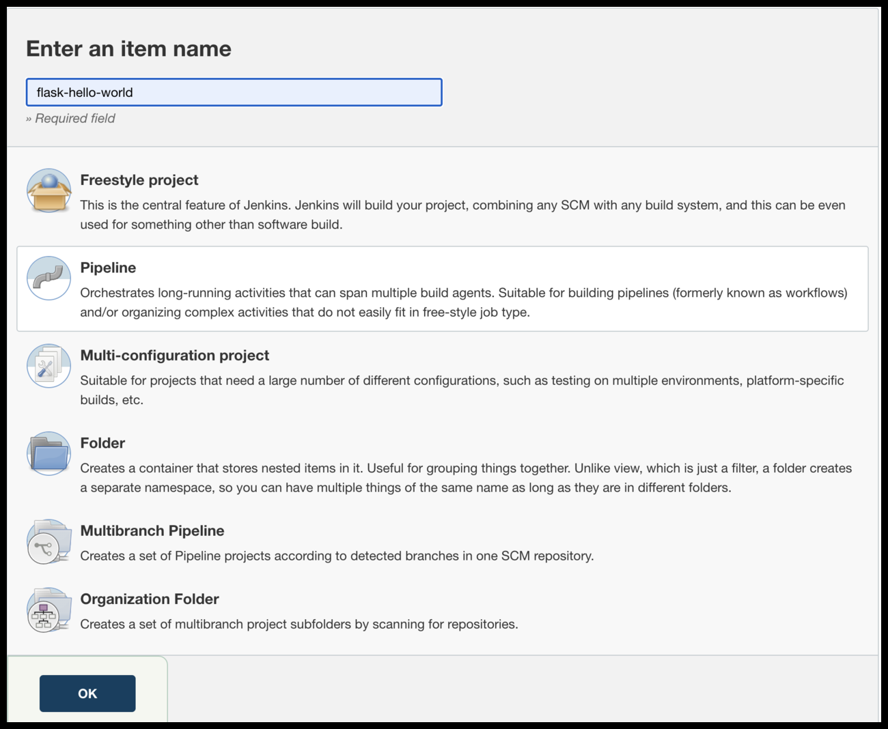
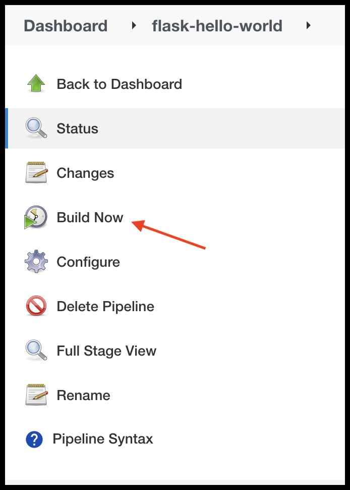
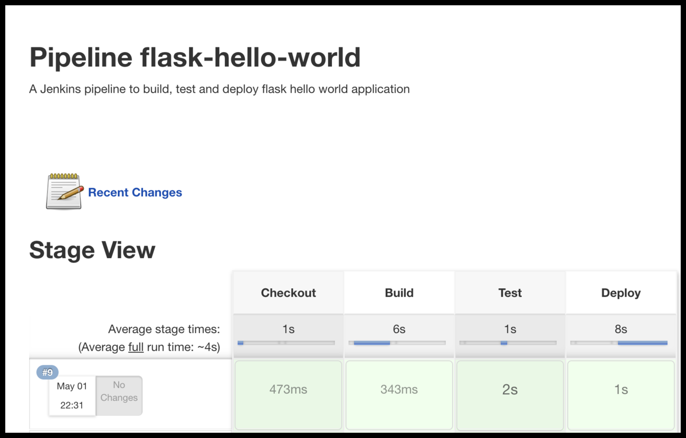

# flask-hello-world-devops-project
Build and deploy code a simple flask application using Jenkins and Kubernetes

In this project, we are going to build a simple [CI/CD](https://www.atlassian.com/continuous-delivery/principles/continuous-integration-vs-delivery-vs-deployment) pipeline from scratch using tools like Flask, Docker, Git, Github, Jenkins and Kubernetes.

## Prerequisites

* Python
* Flask
* Docker
* Git and Github
* Jenkins
* Kubernetes
* Linux machine

## Steps in the CI/CD pipeline
1. Create a "Hello world" Flask application
2. Write basic test cases
3. Dockerise the application
4. Test the code locally by building docker image and running it
5. Create a github repository and push code to it
6. Start a Jenkins server on a host
7. Write a Jenkins pipeline to build, test and push the docker image to Dockerhub.
8. Set up Kubernetes on a host using [Minikube](https://minikube.sigs.k8s.io/docs/start/)
9. Create a Kubernetes deployemt and service for the application.
10. Use Jenkins to deploy the application on Kubernetes

## Project structure

* app.py - Flask application which will print "Hello world" when you run it
* test.py - Test cases for the application
* requirements.txt - Contains dependencies for the project
* Dockerfile - Contains commands to build and run the docker image
* Jenkinsfile - Contains the pipeline script which will help in building, testing and deploying the application
* deployment.yaml - [Kubernetes deployment](https://kubernetes.io/docs/concepts/workloads/controllers/deployment/) file for the application
* service.yaml - [Kubernetes service](https://kubernetes.io/docs/concepts/services-networking/service/) file for the application 

## Create a project repository on Github

Login to your github account and create a new repository. Do make sure that you have give a unique name for the repository. It's good to add a README file, Python .gitignore template and chose a license.



Click on "create repository". Now, the repository is created.



## Clone the repository on your system

Go to your Github repository. Click on the "Code" section and note down the HTTPS url for the project.



Open terminal on your local machine(Desktop/laptop) and run the below commands.

```
git clone https://github.com/codophobia/flask-hello-world-devops-project.git # Replace the url with the url of your project
cd flask-hello-world-devops-project
```

Run ls command and you should be able to see a local copy of the github repository.


## Set up virtual Python environment

Setting up a [virtual Python environment](https://docs.python.org/3/library/venv.html) will help in testing the code locally and also collecting all the dependencies.

```bash
python3 -m venv venv # Create the virtual env named venv
source venv/bin/activate # Activate the virtual env
```

## Create a Flask application

Install the flask module.

```bash
pip install flask
```

Open the repository that you have just cloned in your favourite text editor.
Create a new file named "app.py" and add the below code.

```python
from flask import Flask
import os

app = Flask(__name__)


@app.route("/")
def hello():
    return "Hello world!!!"


if __name__ == "__main__":
    port = int(os.environ.get("PORT", 5000))
    app.run(debug=True, host='0.0.0.0', port=port)
```

The above code when run will start a web server on port number 5000. You can test the code by running it.

```bash
python app.py
```

You should see below output after running the above command.



Open your browser and visit [](http://127.0.0.1:5000). You should see "Hello world" printed on the browser.



## Write test cases using pytest

Install [pytest](https://docs.pytest.org/en/7.1.x/) module. We will use pytest for testing.

```bash
pip install pytest
```

Create a new file named "test.py" and add a basic test case.

```python
from app import app


def test_hello():
    response = app.test_client().get('/')
    assert response.status_code == 200
    assert response.data == b'Hello world!!!'
```

Run the test file using pytest.

```bash
pytest test.py
```

## Run code quality tests using flake

It's always recommened to write quality code with proper coding standards, proper code formatting and code with no syntax errors.

[Flake8](https://flake8.pycqa.org/en/latest/) can be used to check the quality of the code in Python.

Install the flake8 module.

```bash
pip install flake8
```

Run flake8 command.

```bash
flake8 --exclude venv # Ignore files in venv for quality check
```

If you do not see any output, it means that everything is all right with code quality.

Try removing the spaces between comma in the app.py and then run flake8 command again. You should see the following errors.


Add space again and you will not see the error now.

## Dockerise the application

Install docker on your system. Follow [https://docs.docker.com/get-docker/](https://docs.docker.com/get-docker/)

Create a file named "Dockerfile" and add the below code.

```
FROM python:3.6
MAINTAINER Shivam Mitra "shivamm389@gmail.com" # Change the name and email address
COPY app.py test.py /app/
WORKDIR /app
RUN pip install flask pytest flake8 # This downloads all the dependencies
CMD ["python", "app.py"]
```

Build the docker image.

```bash
docker build -t flask-hello-world .
```

Run the application using docker image.

```bash
docker run -it -p 5000:5000 flask-hello-world
```

Run test case

```bash
docker run -it flask-hello-world pytest test.py
```

Run flake8 tests

```bash
docker run -it flask-hello-world flake8
```

You can verify if the application is running by opening the page in the browser.

Push the image to dockerhub. You will need an account on dockerhub for this.

```bash
docker login # Login to dockerhub
docker tag flask-hello-world shivammitra/flask-hello-world # Replace <shivammitra> with your dockerhub username
docker push shivammitra/flask-hello-world
```

## Push the code to github

Till now, we haven't pushed the code to our remote repository. Let's try some basic git commands to push the code.

```bash
git add .
git commit -m "Add flask hello world application, test cases and dockerfile"
git push origin main
```

If you go to github repository, you should see the changes.



## Install Jenkins

In this example, we will be installing jenkins on Ubuntu 20.04 Linux machine. If you have a different Linux distribution, follow steps mentioned at [https://www.jenkins.io/doc/book/installing/linux/](https://www.jenkins.io/doc/book/installing/linux/)

Run the following commands on the server.

```bash
# Install jenkins

curl -fsSL https://pkg.jenkins.io/debian-stable/jenkins.io.key | sudo tee \
/usr/share/keyrings/jenkins-keyring.asc > /dev/null

echo deb [signed-by=/usr/share/keyrings/jenkins-keyring.asc] \
https://pkg.jenkins.io/debian-stable binary/ | sudo tee \
/etc/apt/sources.list.d/jenkins.list > /dev/null

sudo apt-get update
sudo apt install openjdk-11-jre
sudo apt-get install jenkins

# Install docker and add jenkins user to docker group
# Installing docker is important as we will be using jenkins to run docker commands to build and run the application.
sudo apt install docker.io
sudo usermod -aG docker jenkins
sudo service jenkins restart
```

Open your browser and visit [http://127.0.0.1:8080](http://127.0.0.1:8080). If you have installed Jenkins on a Aws/Azure/GCP virtual machine, use the public address of the VM in place of localhost. If you are not able to access on cloud, make sure that port 8080 is added to inbound port.


Copy the admin password from the path provided on the jenkins homepage and enter it. Click on "Install suggested plugins". It will take some time to install the plugins.



Create a new user.


You should now see the jenkins url. Click next and you should see the "Welcome to jenkins" page now.

## Create a Jenkins pipeline

We will now create a jenkins pipeline which will help in building, testing and deploying the application.

Click on "New Item" on the top left corner of the homepage.


Enter a name, select "Pipeline" and click next.



We now need to write a [pipeline script](https://www.jenkins.io/doc/book/pipeline/syntax/) in Groovy for building, testing and deploying code.


Enter the below code in the pipeline section and click on "Save".

```
pipeline {
    agent any
    
    environment {
        DOCKER_HUB_REPO = "shivammitra/flask-hello-world"
        CONTAINER_NAME = "flask-hello-world"

    }
    
    stages {
        stage('Checkout') {
            steps {
                checkout([$class: 'GitSCM', branches: [[name: '*/main']], extensions: [], userRemoteConfigs: [[url: 'https://github.com/codophobia/flask-hello-world-devops-project']]])
            }
        }
        stage('Build') {
            steps {
                echo 'Building..'
                sh 'docker image build -t $DOCKER_HUB_REPO:latest .'
            }
        }
        stage('Test') {
            steps {
                echo 'Testing..'
                sh 'docker stop $CONTAINER_NAME || true'
                sh 'docker rm $CONTAINER_NAME || true'
                sh 'docker run --name $CONTAINER_NAME $DOCKER_HUB_REPO /bin/bash -c "pytest test.py && flake8"'
            }
        }
        stage('Deploy') {
            steps {
                echo 'Deploying....'
                sh 'docker stop $CONTAINER_NAME || true'
                sh 'docker rm $CONTAINER_NAME || true'
                sh 'docker run -d -p 5000:5000 --name $CONTAINER_NAME $DOCKER_HUB_REPO'
            }
        }
    }
}
```

Click on "Build Now" button at the left of the page.



The pipelines should start running now and you should be able to see the status of the build on the page.



If the build is successful, you can visit [http://127.0.0.1:5000](http://127.0.0.1:5000) and you should see "Hello world" on the browser. If you have installed Jenkins on a Aws/Azure/GCP virtual machine, use the public address of the VM in place of localhost. If you are not able to access on cloud, make sure that port 5000 is added to inbound port.

## Pipeline script from SCM

We can also store the Jenkins pipeline code in our github repository and ask Jenkins to execute this file.

Go to "flask-hello-world" pipeline page and click on "Configure".

Change definition from "Pipeline script" to "Pipeline script from SCM" and fill details on SCM and github url. Save the pipeline.


Now, create a new file named "Jenkins" in our local code repository and add the below pipeline code.

```
pipeline {
    agent any
    
    environment {
        DOCKER_HUB_REPO = "shivammitra/flask-hello-world"
        CONTAINER_NAME = "flask-hello-world"

    }
    
    stages {
        /* We do not need a stage for checkout here since it is done by default when using "Pipeline script from SCM" option. */
        

        stage('Build') {
            steps {
                echo 'Building..'
                sh 'docker image build -t $DOCKER_HUB_REPO:latest .'
            }
        }
        stage('Test') {
            steps {
                echo 'Testing..'
                sh 'docker stop $CONTAINER_NAME || true'
                sh 'docker rm $CONTAINER_NAME || true'
                sh 'docker run --name $CONTAINER_NAME $DOCKER_HUB_REPO /bin/bash -c "pytest test.py && flake8"'
            }
        }
        stage('Deploy') {
            steps {
                echo 'Deploying....'
                sh 'docker stop $CONTAINER_NAME || true'
                sh 'docker rm $CONTAINER_NAME || true'
                sh 'docker run -d -p 5000:5000 --name $CONTAINER_NAME $DOCKER_HUB_REPO'
            }
        }
    }
}
```

Push the code to github.

```bash
git add .
git commit -m "Add Jenkinsfile"
git push origin main
```

Go to "flask-hello-world" pipeline page and click on "Build Now"


